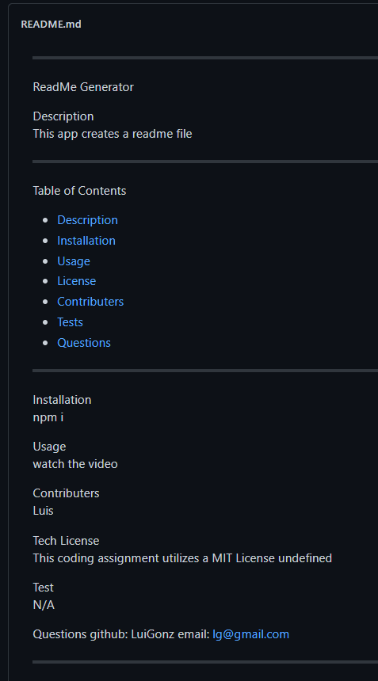

  
 --------------------------------------------
 ReadMe Generator

 Description 
  This app creates a readme file

 --------------------------------------------

 Table of Contents
 - [Description](#description)
 - [Installation](#installation)
 - [Usage](#usage)
 - [License](#license)
 - [Contributers](#contributers)
 - [Tests](#tests)
 - [Questions](#questions)

 --------------------------------------------

 Installation 
 npm init -y, npm i inquirer --save

 Usage 
 watch video

 Contributers 
 Luis

Tech License This coding assignment utilizes a GNU General Public License v3.0,MIT License,Mozilla Public License v2.0 
 undefined

 Test 
 N/A

 Questions 
 github: LuiGonz 
 email: lg@gmail.com

 Example 
 

 --------------------------------------------
  